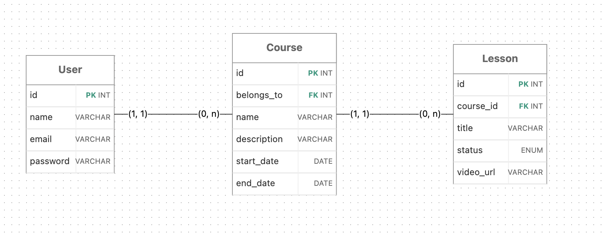

# Arquitetura, decisões técnicas e implementações

## Visão geral

O CourseSphere é um mono-repo com backend e frontend completamente separados, comunicando-se via API REST JSON.

```
Browser
  │
  ▼
React + Vite — porta 5173
  │  HTTP + Authorization: Bearer <token>
  ▼
Rails API — porta 3000
  │
  ▼
PostgreSQL — porta 5432
```

---

## Banco de dados



### Índices criados

| Tabela | Coluna | Motivo |
|--------|--------|--------|
| users | email | Consulta recorrente no login e validação de unicidade |
| users | auth_token | Consulta recorrente a cada requisição autenticada |
| courses | name | Busca por nome com `ILIKE` |
| courses | creator_id | Joins frequentes para listar cursos do usuário |

---

## Restrição de acesso para usuários não autenticados

Toda rota protegida no backend passa por um `before_action :authenticate_user!` definido no `ApplicationController`:

```ruby
def authenticate_user!
  unless current_user
    render json: { error: 'Unauthorized' }, status: :unauthorized
  end
end

def current_user
  header = request.headers['Authorization']
  token = header.split(' ').last if header
  User.find_by(auth_token: token) if token
end
```

O método `current_user` lê o token do header `Authorization: Bearer <token>`, busca o usuário correspondente no banco e o retorna. Se o token for inválido, ausente ou já invalidado (logout), `current_user` retorna `nil` e o `authenticate_user!` encerra a requisição com status `401 Unauthorized`.

No frontend, o `PrivateRoute` complementa essa proteção — redireciona para a home qualquer tentativa de acessar uma rota autenticada sem usuário logado no estado da aplicação:

```jsx
export default function PrivateRoute({ children }) {
  const { user } = useAuth()
  return user ? children : <Navigate to="/" replace />
}
```

---

## Restrição de criação, edição e exclusão por propriedade

Como apenas o criador pode tomar uma ação destrutiva/edição sobre um curso ou aula de sua propriedade, essas operações são protegidas no controller pela verificação:

```ruby
def update
  if @course.creator != current_user
    render json: { error: "Forbidden" }, status: :forbidden
    return
  end
  # ...
end
```

No frontend, os botões de editar e excluir só são renderizados na página "Meus cursos", que carrega exclusivamente os cursos do usuário autenticado (`GET /courses?mine=true`).

---

## Validações nas entidades do banco

As validações poderiam ser feitas em 3 camadas diferentes, no front, na api ou no banco.

Deixar a validação apenas no front é um problema sério e concentrar as regras de negócio no banco pode atrapalhar a manutenção do mesmo.

Colocar a validação no model da entidade, garante que de onde quer que seja acessada, a API vai fazer essas validações mais complexas como formato de URL válido. 

Outras constraints básicas como unicidade do email também estão presentes no banco.

> Exemplos:

**User**
```ruby
validates :name, presence: true

validates :email, presence: true, uniqueness: true,
          format: { with: URI::MailTo::EMAIL_REGEXP }

has_secure_password
```

**Course**
```ruby
validates :name, presence: true, length: { minimum: 3 }

validates :start_date, presence: true
validates :end_date, presence: true,
          comparison: { greater_than_or_equal_to: :start_date }
```

**Lesson**
```ruby
validates :title, presence: true, length: { minimum: 3 }
enum :status, { draft: "draft", published: "published" }, default: :draft
# O enum restringe os valores aceitos e traz alguns métodos interessantes para o caso

validate :video_url_format, if: -> { video_url.present? }

```

---

## Consumo da RandomUser API

A [RandomUser API](https://randomuser.me) é uma API pública que retorna dados de usuários fictícios sem necessidade de autenticação.

A chamada é feita diretamente no frontend, dentro do `CourseCard.jsx`, ao expandir um card pela primeira vez:

```javascript
const instructorRes = await fetch('https://randomuser.me/api/')
const data = await instructorRes.json()
const instructor = data.results[0]
```

A resposta contém nome, foto e outros dados. O CourseSphere utiliza apenas:
- `instructor.picture.medium` URL da foto
- `instructor.name.first` e `instructor.name.last` 


```javascript
const [lessonsRes, instructorRes] = await Promise.all([
  api.get(`/courses/${course.id}/lessons`),
  fetch('https://randomuser.me/api/').then(r => r.json())
])
```

---

## Instrutor convidado e persistência no localStorage

Como a RandomUser API retorna um usuário aleatório a cada chamada, sem persistência o instrutor mudaria toda vez que o card fosse fechado e reaberto.

A solução foi persistir o instrutor no `localStorage` do browser usando o `id` do curso como chave:

```javascript
// Ao expandir o card, verificar se já existe um instrutor salvo
const stored = localStorage.getItem(`instructor_${course.id}`)
if (stored) {
  setInstructor(JSON.parse(stored))
  // Não faz nova chamada à API
  return
}

// Se não existe, buscar e persistir
const fetched = instructorRes.results[0]
localStorage.setItem(`instructor_${course.id}`, JSON.stringify(fetched))
setInstructor(fetched)
```

Isso garante que cada curso tem sempre o mesmo instrutor convidado, sem persistir no banco de dados.

---


## Busca por nome de curso

A busca é implementada no backend 

```ruby
def index
  # coleta todos cursos ou somente do current_user
  courses = params[:mine] == "true" ? current_user.created_courses : Course.all
  # Carrega os criadores junto aos cursos numa única query
  courses = courses.includes(:creator)
  # Retorna qualquer curso cujo parâmetro de busca esteja contido (case-isensitive)
  courses = courses.where("name ILIKE ?", "%#{params[:search]}%") if params[:search].present?
  render json: courses.map { |c| course_json(c) }
end
```

---

## Filtro de status de aulas

O filtro de status é implementado em duas camadas:

**Backend** — suporta o parâmetro `?status=` no endpoint de lessons:

```ruby
def index
  lessons = @course.lessons
  lessons = lessons.where(status: params[:status]) if params[:status].present?
  render json: lessons
end
```

**Frontend** — botões de filtro no `CourseCard` que atualizam um estado local:

```javascript
const filteredLessons = statusFilter === 'all'
  ? lessons
  : lessons.filter(l => l.status === statusFilter)
```

Quando `editable=false` (Dashboard da comunidade), uma camada adicional esconde as aulas em rascunho:

```javascript
const visibleLessons = editable
  ? filteredLessons
  : filteredLessons.filter(l => l.status === 'published')
```

Usuários da comunidade não vêem rascunhos de outros criadores.

---

## Layout 

O layout foi pensado para ser intuitivo seguindo referências de outras plataformas de curso, como por exemplo a [digital innovation one](https://www.dio.me/)